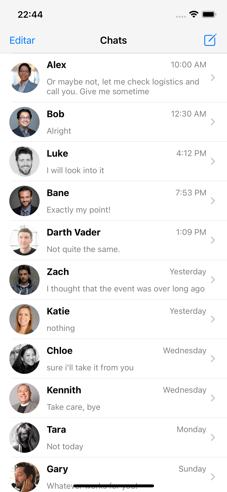

# Clone da tela Home do WhatsApp

Print da tela desenvolvida

Para desenvolver esse exercicio foi utilizado:
* Swift/View code
* NavigationController
* TableView
* TablewViewCell costumizada
* UIKit
* Xcode 13.2.1

Api de conversas utilizada foi a [Fake_Chat_API](https://github.com/karthikJagadeesh/fake-chat-api/blob/master/db.json) do GitHub do [Karthik_Jagadeesha](https://github.com/karthikJagadeesh)